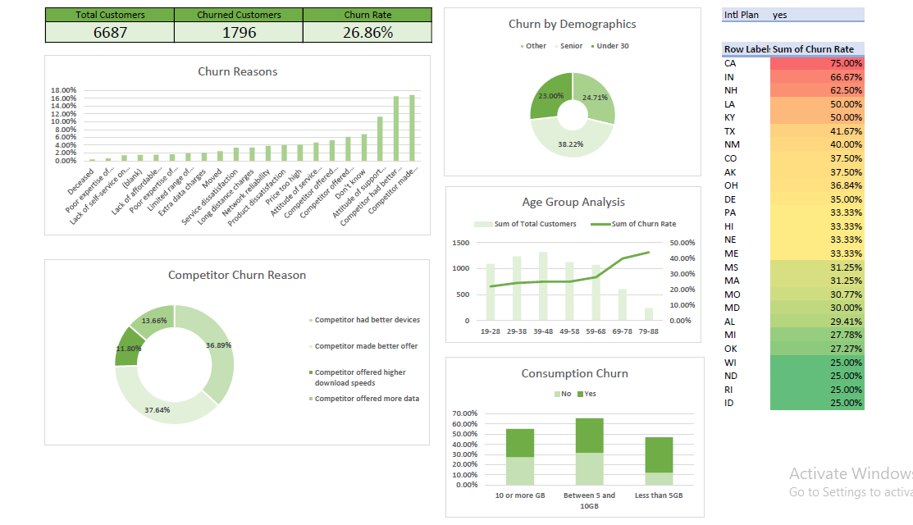

# 📊 Excel Projects

Welcome to my Excel project portfolio! This repository contains business analysis and dashboard projects built using Microsoft Excel. These projects showcase my ability to structure data, generate insights, and present them through interactive dashboards.

---

## 🧠 About Me

I'm a data enthusiast focused on delivering insights using tools like Excel, Power BI, and Python. I enjoy working with real-world datasets to create clean, functional, and insightful dashboards for decision-making.

---

## 📁 Case Study

### 📉 Customer Churn Analysis

- **Folder:** `Customer Churn Analysis/`
- **Notebook:** [`CustomerChurnAnalysis_Case_Study.ipynb`](CustomerChurnAnalysis_Case_Study.ipynb)
- **Dashboard Screenshot:**  
  

#### 🏢 Business Context

In this project, I analyzed a telecom company's customer churn data using Excel. The goal was to identify key drivers of churn and provide strategic recommendations for customer retention.

---

#### 🔍 Key Insights

- **Overall churn rate:** 26.86% out of 6,687 customers  
- **Top churn reasons:** Competitor devices, better offers, and more data  
- **Demographic patterns:** Seniors show the highest churn rate (38.22%)  
- **State-level trends:** California (CA) has the highest churn rate at 75%  
- **Consumption behavior:** Customers using less than 5GB churn more frequently  
- **Age trend:** Churn rate increases steadily with age  

---

#### 🛠️ Excel Features Used

- PivotTables & PivotCharts  
- Slicers and Conditional Formatting  
- IF formulas and calculated columns  
- Dynamic KPIs and donut charts  
- Heat map by state using color scaling  

---

## 📫 Contact

- X (formerly Twitter): [@0x5walter](https://x.com/0x5walter)
